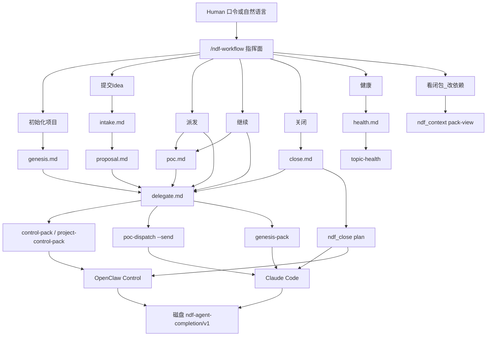
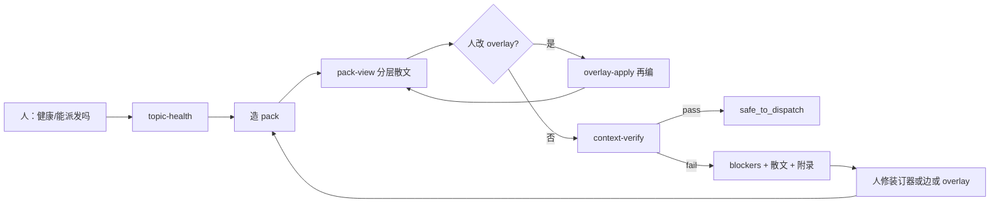
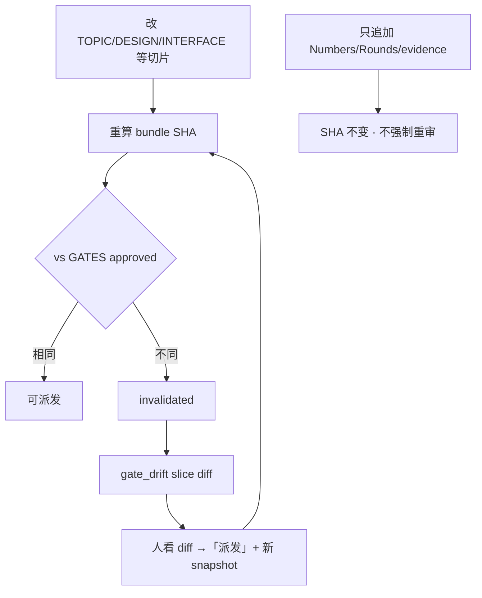
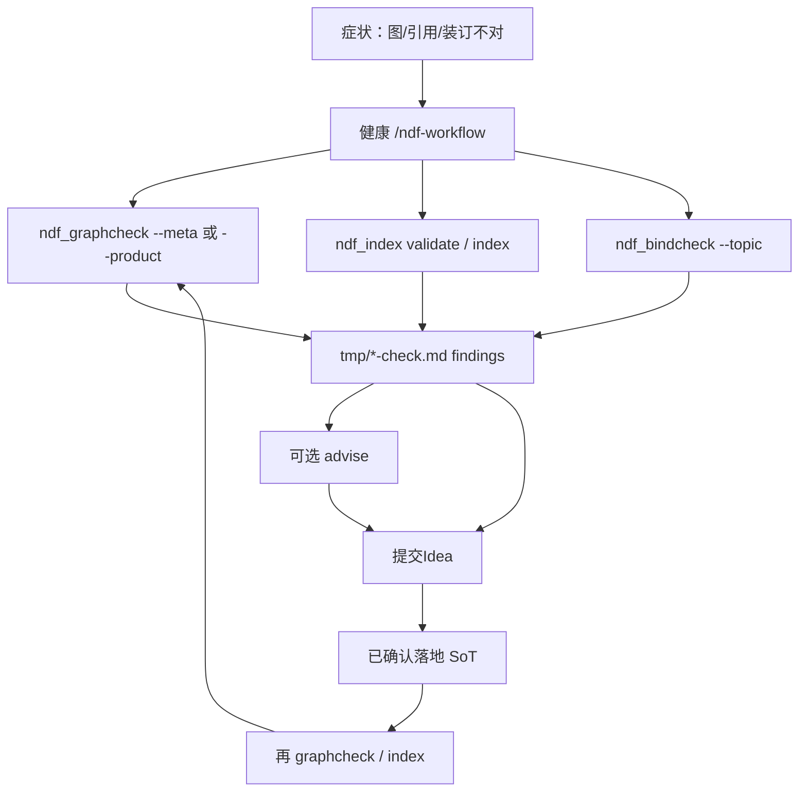

# NDF Workflow 总览（调用图 + 闭环）

> **入口**：Command Agent + `skill/ndf-workflow/`（Cursor 见 [`../adapters/cursor/`](../adapters/cursor/)）  
> **权威**：installed `AGENTS.md` + `spec/meta/`  
> **日期**：2026-08-31（META-024 分层人审散文）  
> **非 SoT**：本文是人类可读总览；条款正文以 `spec/meta/process.md` 为准。

---

## 0. 一句话

人维护 **树+图**（条款与 `depends-on`），指挥面编出 **分层散文给人审/改**，再委派
OpenClaw（文档）/ Claude Code（代码）→ 磁盘 `ndf-agent-completion/v1`。  
五句口令是快捷入口，不是唯一动词（[[META-023]] / [[META-024]]）。无 Commander / Episode / Replay 面板义务。

| 层 | 谁 | 做什么 |
|----|-----|--------|
| 定义面 | 人 + Markdown / graphcheck | 写条款、改 `depends-on` |
| 观察面 | Command + `ndf_context pack-view` | **分层散文**（spec 章 + 装订切片）；overlay 再编 |
| 指挥面 | Command Agent + `ndf-workflow` | 口令快捷、等人审、造 pack、报 blockers |
| OpenClaw | Control | `spec/open/`、`spec/meta/open/`、`poc/<topic>/ndf/` |
| Claude Code | Implementation | `poc-dispatch` / `genesis-pack` / close 合入 |

成功 = 磁盘 completion；transport ACK ≠ success。

---

## 1. Skill / 模块调用图

内部 `*.md` 是**模块**（Agent 操作路径），不是让用户再选的第二套 skill；人仍可读图与 pack-view。



### 口令 → 工作流

| 人说 | 内部模块 | 等人一句 | 委派谁 |
|------|----------|----------|--------|
| 初始化项目 | genesis → delegate | `角色已配置` / `派发` / `GENESIS已审核` | Control 写骨架 `00–50`；greenfield 先 `ndf_genesis_idea.py check`；另可 `genesis-pack` |
| 提交Idea | intake → proposal → delegate | 「已确认」（审提案 markdown） | OpenClaw |
| 已审核（poc 装订器） | poc | 「派发」 | Command 造 pack-view；不 send |
| 派发 | pack-view 已展示 → poc + delegate | 「派发」后开租约 | POC→Implementation |
| 继续 | poc + delegate（可 overlay） | 再「派发」 | OpenClaw 改装订器 → Claude |
| 关闭 | close → delegate | 选 promote/partial/reject | Claude 合入 ± OpenClaw 收口 |
| 健康 | health | — | 只读；不派发 |
| 看闭包 / 改依赖 | `ndf_context pack-view` / `overlay-apply` | 可选「派发」 | 不强制 |

### Idea 平面（intake）

| plane | 写根 |
|-------|------|
| product | `spec/open/` |
| process | `spec/meta/open/` |
| mixed | 拆两个互相引用的提案 |
| ambiguous | **先问人**；MUST NOT 默认 poc |

### 内部模块文件

| 文件 | 职责 |
|------|------|
| `SKILL.md` | 入口：口令快捷 + 图/pack 观察、三层合同、硬规则 |
| `intake.md` | Idea 平面分流 |
| `proposal.md` | 写提案；等人确认/审核 |
| `genesis.md` | bootstrap G0–G3 |
| `poc.md` | 装订 → 派发/继续；SHA 漂移先看 diff |
| `close.md` | `ndf_close plan` |
| `health.md` | topic-health / graphcheck；不派发 |
| `delegate.md` | 唯一委派合同 |

旁路指针：`skills/ndf-workflow/SKILL.md` → 本目录。退役：`ndf-harness` 墓碑（勿作入口）。

---

## 2. 闭环 A — Context：人如何检查（[[META-023]] / [[META-024]]）

人**不**依赖可视化 Compiler 面板，但 **MUST** 能打开人读**分层散文**（不是节点表）。



| 对人可见 | 对人不可见 / 不要求 |
|----------|---------------------|
| `tmp/ndf-pack-view-*.md` **主文**：spec 章条款正文（标题下溯源行）+ POC 装订切片 | 节点/边表当主文 |
| 附录：seed、边、SHA、截断（机器校对） | Commander / Episode / Replay / Canvas |
| `safe_to_dispatch` / blockers | 两边 agent 各自拼不同上下文 |
| 树内 `depends-on`（人直接改） | 把 `graph.json` 当 SoT；必须选 CLI 子命令 |

OpenClaw 与 Claude 的 role plan MUST 引用同一 `manifest_sha`。

---

## 3. 闭环 B — 人修改后如何识别

身份钉 = review-slice **bundle SHA**；人审 UI = **slice unified diff**（META-010）。



| 改动 | 是否重审 |
|------|----------|
| TOPIC / DESIGN / PERF bind / DELTA 假设 / INTERFACE 契约切片 | **要** → 看 diff →「派发」 |
| Numbers / Rounds / evidence / COMMITS / GATES 追加 / TOPIC 导航头 | **不要**（不进 SHA） |

指挥面遇拦 MUST 展示 `gate_drift_markdown` 或 `tmp/ndf-gate-drift-<topic>.md`，禁止只甩两个 hex。  
写「派发」回执时 MUST `persist_gate_slice_snapshot`，否则下次只能 `diff_unavailable`。

---

## 4. 闭环 C — 健康检查与 NDF 图（RAG）修复



| 工具 | 查什么 | 人怎么修（经 `/ndf-workflow`） |
|------|--------|--------------------------------|
| `ndf_graphcheck.py --meta` / `--product` | 环、stable→draft、conflicts、悬空 depends-on | 提交Idea → 落地条款 → 再检 |
| `ndf_index.py validate` / `index` | 可索引性、断链、重建索引 | 修引用后 `index` |
| `ndf_bindcheck.py check --topic` | 装订器双头、ledger/trailer、粒度 | 改 `poc/<topic>/ndf` 或提案 |
| `topic-health` / `spec-health` | 闸、隔离、findings 汇总 | 按 `repair_owner` 分流 |
| `advise`（graph/bind） | 局部选项；**不写 SoT** | 人选方案后再提案落地 |

报告默认写仓库 `tmp/`（已 gitignore）；MUST NOT 写入 `spec/open/`。

### 硬门 vs 软审计（日常 POC）

`poc-dispatch` **硬拦**：身份、人审 bundle SHA、写根/隔离、并发、context verify、ACP 预算、磁盘 completion。  

下列默认 **soft**（不单独挡日常派发）：全量 meta graph、全量 bindcheck、projection/Replay 仪式。  
健康诊断与 close/promote 时再强制图/绑定检查。

---

## 5. 端到端总环

```text
Idea → 提案「已确认」「已审核」
  → 装订器 poc/<topic>/ndf/
  → 人「派发」(bundle SHA + slice snapshot)
  → pack(context-verify, 同 manifest_sha)
  → worker → 磁盘 ndf-agent-completion/v1
  →「继续」: 改切片? → gate_drift diff → 再派发
             只加测数? → SHA 不重审
  →「健康」: topic-health → graphcheck / bindcheck / index
             → advise? → 提交Idea 修 SoT → 再检
  →「关闭」: ndf_close plan → 合入或 reject
             → index + graphcheck（及适用时编译/性能/金标）
```

---

## 6. 常用命令（指挥面内部；勿让用户背）

```bash
# Claude Code POC
python3 spec/meta/tools/ndf_workflow_status.py poc-dispatch \
  --topic <topic> --intent implement|measure --send

# OpenClaw Control
python3 spec/meta/tools/ndf_workflow_status.py control-pack … --json
python3 spec/meta/tools/ndf_dispatch_send.py \
  --pack-file tmp/ndf-dispatch-last-pack.json

# 健康 / 图
python3 spec/meta/tools/ndf_workflow_status.py topic-health --topic <topic> --json
python3 spec/meta/tools/ndf_graphcheck.py --meta
python3 spec/meta/tools/ndf_graphcheck.py --product
python3 spec/meta/tools/ndf_index.py validate
python3 spec/meta/tools/ndf_bindcheck.py check --topic <topic>

# 关闭
python3 spec/meta/tools/ndf_close.py plan --topic <topic> --mode promote|partial|reject
```

---

## 7. 相关文件

| 路径 | 说明 |
|------|------|
| `.cursor/skills/ndf-workflow/SKILL.md` | 人类唯一入口 |
| `spec/meta/process.md` | META-010/011/012 等条款 |
| `spec/meta/tools/README.md` | graphcheck / bindcheck / advise |
| `spec/meta/open/proposal-meta-gate-drift-diff.md` | 闸漂移须附 slice diff（已审核） |
| Canvas 总览 | `canvases/ndf-workflow-overview.canvas.tsx` |
| Canvas 分图（历史） | `ndf-workflow-call-graph` · `ndf-workflow-closed-loops` |
